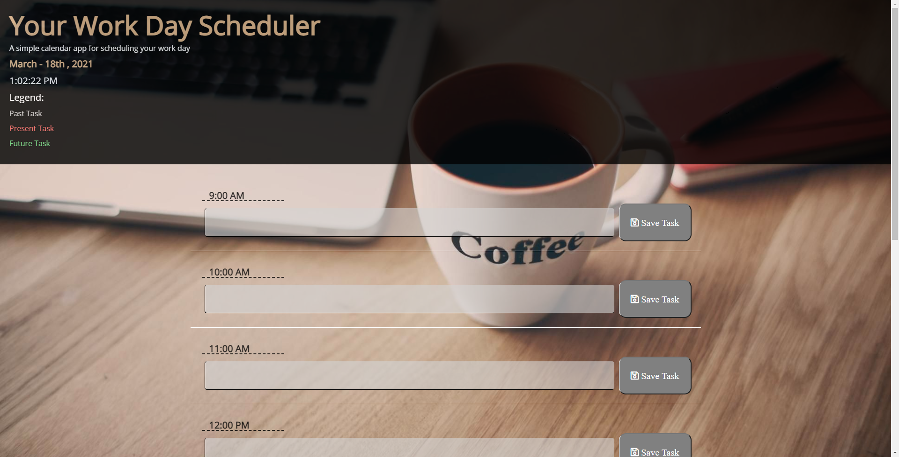

# Third-Party APIs Challenge: Work Day Scheduler 

## PROJECT DESCRIPTION

---

- Develop an app that will allow a user to schedule their typical work day from 9-5
- Use Moment.js to apply time to app
- Use JQuery.js for functionality
- Use of localStorage for saving user tasks
- Color code blocks dependent on time of day

---

### CODING PLATFORMS USED: 

---

- HTML
- CSS
- JAVASCRIPT
- MOMENT.JS
- JQUERY.JS
- BOOTSTRAP

#### SCREENSHOTS: 

---

## 

##### LINKS:

---

## [GitHub Work_Day_Scheduler Repo](https://github.com/MichealJWEllis/Work_Day_Scheduler)

## [Work_Day_Scheduler Website](https://michealjwellis.github.io/Work_Day_Scheduler/)

---

#### CONTRIBUTION: 

Made with ❤️ by [Micheal Jw Ellis]
